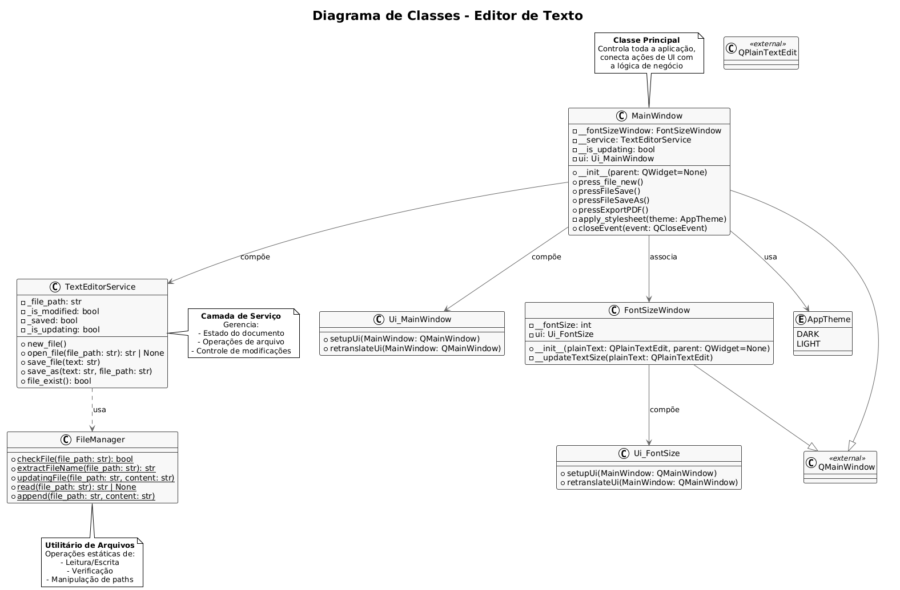

## Overview
This is a simple text editor made in Python using Pyside6 (Qt Framework) to develop the GUI and qt-linguist to switch application language dinamically.

## Instructions

This how I converted GUI Qt designer files into python files to integrate them in the project

```shell
pyside6-uic UIMainWindow.ui -o UIMainWindow.py
```
This command below opens Qt Linguist
```shell
pyside6-linguist
```
## Class Diagram here: (In Progress)

https://lucid.app/lucidchart/b3bc5f04-7113-4b4d-bba3-53429326a05e/edit?invitationId=inv_cd46ab9e-c2cd-4486-b359-e808e8bd015f&page=HWEp-vi-RSFO#

## PlantUML Code (In Progress)

```
@startuml
!theme plain

skinparam class {
    BackgroundColor #F8F8F8
    BorderColor #444
    ArrowColor #666
    FontName Helvetica
}

skinparam defaultTextAlignment center

title Diagrama de Classes - Editor de Texto

' 1. Classes de UI
class Ui_MainWindow {
  + setupUi(MainWindow: QMainWindow)
  + retranslateUi(MainWindow: QMainWindow)
}

class Ui_FontSize {
  + setupUi(MainWindow: QMainWindow)
  + retranslateUi(MainWindow: QMainWindow)
}

class FontSizeWindow {
  - __fontSize: int
  - ui: Ui_FontSize
  + __init__(plainText: QPlainTextEdit, parent: QWidget=None)
  - __updateTextSize(plainText: QPlainTextEdit)
}

' 2. Classes de Serviço
class TextEditorService {
  - _file_path: str
  - _is_modified: bool
  - _saved: bool
  - _is_updating: bool
  + new_file()
  + open_file(file_path: str): str | None
  + save_file(text: str)
  + save_as(text: str, file_path: str)
  + file_exist(): bool
}

class FileManager {
  + {static} checkFile(file_path: str): bool
  + {static} extractFileName(file_path: str): str
  + {static} updatingFile(file_path: str, content: str)
  + {static} read(file_path: str): str | None
  + {static} append(file_path: str, content: str)
}

' 3. Classes de Aparência
enum AppTheme {
  DARK
  LIGHT
}

' 4. Classe Principal
class MainWindow {
  - __fontSizeWindow: FontSizeWindow
  - __service: TextEditorService
  - __is_updating: bool
  - ui: Ui_MainWindow
  + __init__(parent: QWidget=None)
  + press_file_new()
  + pressFileSave()
  + pressFileSaveAs()
  + pressExportPDF()
  - apply_stylesheet(theme: AppTheme)
  + closeEvent(event: QCloseEvent)
}

' 5. Relacionamentos
MainWindow --> Ui_MainWindow : compõe
MainWindow --> TextEditorService : compõe
MainWindow --> FontSizeWindow : associa
MainWindow --> AppTheme : usa

FontSizeWindow --> Ui_FontSize : compõe

TextEditorService ..> FileManager : usa

' 6. Classes Qt (simplificadas)
class QMainWindow <<external>> {
  __
}

class QPlainTextEdit <<external>> {
  __
}

MainWindow --|> QMainWindow
FontSizeWindow --|> QMainWindow

' 7. Notas explicativas
note top of MainWindow
  **Classe Principal**
  Controla toda a aplicação,
  conecta ações de UI com
  a lógica de negócio
end note

note right of TextEditorService
  **Camada de Serviço**
  Gerencia:
  - Estado do documento
  - Operações de arquivo
  - Controle de modificações
end note

note bottom of FileManager
  **Utilitário de Arquivos**
  Operações estáticas de:
  - Leitura/Escrita
  - Verificação
  - Manipulação de paths
end note

@enduml
```

## Image 

